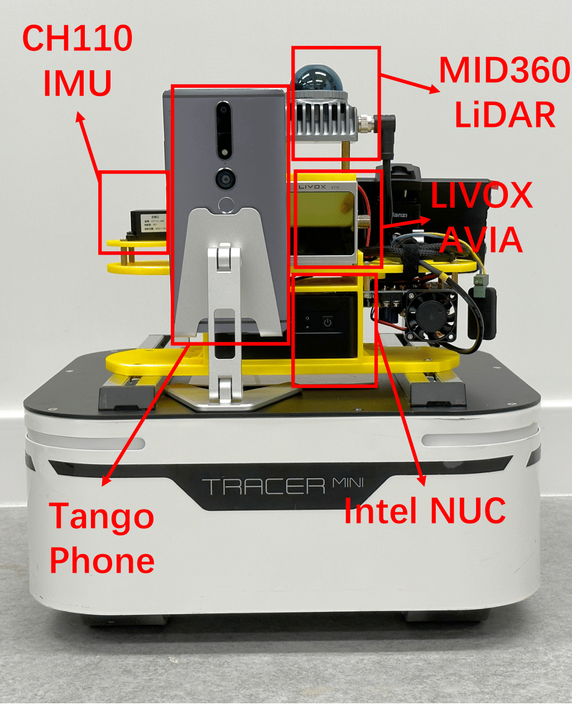
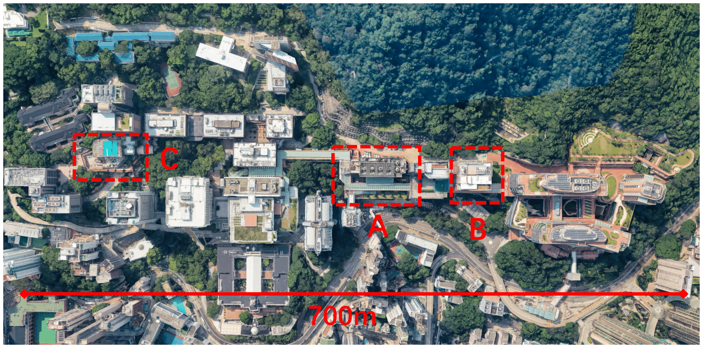

# NeurIT: Pushing the Limit of Neural Inertial Tracking for Indoor Robotic Things

This repository contains the system set up for NeurIT, the self-built dataset, and the source code for ***TF-BRT***.

## 1. System Setup

To collect robotic tracking data, my collaborator helped built up a customized robotic system. As shown in the following picture, the system is composed of six parts:

**1) CH110 IMU**

Collect raw IMU data, including accelerations, gyroscopes, and magnetometers. In addition, it provides the pose information of the robot.

**2) Intel NUC**

An Intel NUC with an i7-1260P CPU, 32GB memory, is used for running the whole system.

**3) [MID360 LiDAR](https://www.livoxtech.com/mid-360)**

The hardware for FAST-LIO algorithm. FOV: 360°*59°; Point Cloud Density: 40-line.

**4) [LIVOX AVIA](https://www.livoxtech.com/avia)**

A narrow-FOV LiDAR, which is used to demonstrate the fact that LiDAR-inertial tracking systems cannot work well in simple and plain indoor environments.

**5) [Tango Phone](https://www.lenovo.com/il/en/tango/)**

A commercialized visual-inertial tracking system for comparison.

**6) [Tracer Mini](https://www.agilex.ai/chassis/2)**

We use AgileX Tracer-Mini for the robot’s territory.



We build up a workspace for ROS to collect the IMU data and the ground truth (FAST-LIO). You can download the worksapce via this link [System Setup (Software)](https://datahub.hku.hk/collections/NeurIT/7086466). For instance, we costomize a ROS topic `imu_all` to publish the data we want to collect. You can follow the following file in the workspace for data collection: `/mid360_ws/src/imu/serial_imu/scripts/subscriber.py`

## 2. Dataset

To verify the effectiveness of our proposed ***TF-BRT***, we collect NeurIT dataset. The dataset is collected across three buildings in the campus. The dataset is splited into four parts: training set, validation set, test seen set, and test unseen set.



Training, validation, and test seen sets are collected in Building A (floor 1 & floor 5). Test unseen set is collected in Building B and Building C. NeurIT dataset contains 110 sequences, totaling around 15 hours of tracking data that corresponds to a travel distance of about 33.7 km. Each sequence of data lasts 6∼10 minutes. You can download the dataset via this link [NeurIT Dataset](https://datahub.hku.hk/collections/NeurIT/7086466).

The file includes `original_data`, `uniform_data`, and `data_gen_neurit.py`. You can use `data_gen_neurit.py` file to convert `original_data` to the `uniform_data`. The data pre-processing methods include time synchronization, and coordinate system transformation. The `original_data` contains the raw data collected from IMU and the ground truth. The data format is given below:

```
synced
├── acce (acceleration in body frame)
├── gyro (gyroscope in body frame)
├── magnet (magnetometer measured in body frame)
├── rv (rotation vector in quaternion format)
├── time (time stamp: 200Hz)

pose
├── time (timestamp)
├── fastlio_pos (position of the robot in navigation frame)
├── fastlio_ori (orientation of the robot in navigation frame)

```

When you want to train ***TF-BRT***, please use the data in `uniform_data`.

## 3. TF-BRT (Time-Frequency Block-Recurrent Transformer)

You could download or git clone this repository to test the performance of **TF-BRT**. It contains three steps for training and evaluation.

1. Configuration
2. Training
3. Testing

#### 3.1 Configuration

All of the hyperparameters, model path, data path are defined in `tf-brt/source/config.py` for convenience, as you donnot have to type in anything in the command line.

Please download the NeurIT dataset to the folder, and fill in necessary path information before ***training***. The following setting code is for your reference.

```python
DATASET = "neurit" # Dataset name
MODEL_TYPE = "tf-brt"
DATA_DIR = './NeurIT Dataset/uniform_data/train_dataset' # Dataset directory for training
VAL_DATA_DIR = './NeurIT Dataset/uniform_data/val_dataset' # Dataset directory for validation
TEST_DIR = './NeurIT Dataset/uniform_data/test_seen' # Dataset directory for testing (test_seen & test_unseen)
OUT_DIR = './prediction_model/neurit/test1' # Output directory for both traning and testing
```

Please go through `config.py` file scrupulously before entering the training stage. Feel free to adjust the hyperparameters if you like.

#### 3.2 Training

After everthing is done, you can type in `python tf-brt.py --mode train` in your command line for training. The **checkpoints** will be stored in the `OUT_DIR` defined in the `config.py` file.

#### 3.3 Testing

In NeurIT dataset, we have `test_seen` and `test_unseen` datasets. For begin with, you need to change the setting for `TEST_DIR`, `OUT_DIR`, and `MODEL_PATH`.

The following setting code is for your reference (`test_seen`):

```python
TEST_DIR = './NeurIT Dataset/uniform_data/test_seen' # Dataset directory for testing (test_seen & test_unseen)
OUT_DIR = './NeurIT/tf-brt/result/neurit/test1/seen' # Output directory for both traning and testing
MODEL_PATH = './NeurIT/tf-brt/prediction_model/neurit/test1/checkpoints/checkpoint.pt' # Model path for testing
```

Then, the testing results, including trajectory visualizations, and four evaluation metrics (ATE, RTE, PDE, AYE), will be recorded in the output file. Please refer to the paper for more details about the evaluation metrics.
